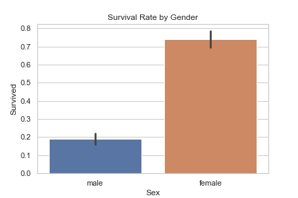
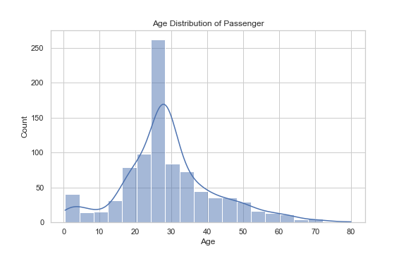
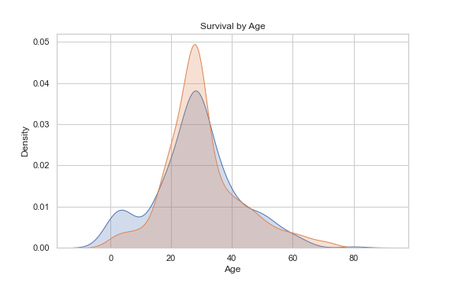
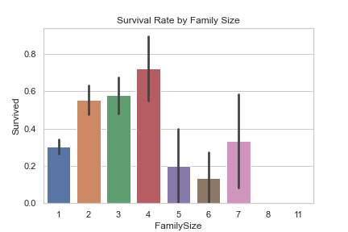

# Titanic Survival Analysis 🚢

## 📌 Project Overview
This project is an **Exploratory Data Analysis (EDA)** on the Titanic dataset.  
The goal is to uncover hidden survival patterns and demonstrate **data cleaning, visualization, and storytelling with data**.  

This project aligns with my passion for **Data Science, Analytics, and uncovering patterns in real-world datasets**.

---

## 🛠️ Tools & Libraries
- Python  
- Pandas  
- Numpy  
- Matplotlib  
- Seaborn  
- Jupyter Notebook  

---

## 🔍 Dataset
- Source: [Kaggle Titanic Dataset](https://www.kaggle.com/c/titanic/data)  
- Files used: `train.csv`, `test.csv`

---

## 📊 Key Insights
- **Gender**: Women had a survival rate of ~74%, men only ~19%.  
- **Class**: 1st Class passengers had ~62% survival vs 24% in 3rd Class.  
- **Age**: Children (<10 years) had better survival chances.  
- **Family Size**: People with small families had better chances than those traveling alone.  

---

## 📈 Visualizations
### Survival Rate by Gender

### Survival Rate by Passenger Class

### Age Distribution

### Survival by Age

### Survival by Family Size

---

## 🚀 Future Work
- Build predictive machine learning models (Logistic Regression, Random Forest, XGBoost).  
- Deploy as an interactive dashboard using Streamlit/Flask.  

---

## ✨ Author
👤 Neel Shah  
🔗 [LinkedIn](https://www.linkedin.com/in/neelshah13/) | [GitHub](https://github.com/NeelShah13)
